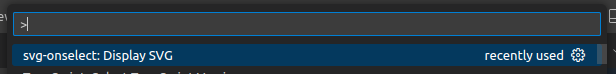
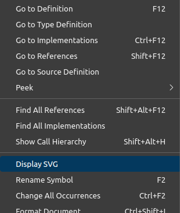

# svg-onselect

A VS Code extension to display SVG on selection. 
Extension command can be accessed from the command palette (`ctrl/cmd + shift + p`) or editor's context menu, **only when there's a selection.**  

Command Palette 
  

Context menu 

## Issues

Open a PR if you have one.

## v1.0.0

Initial release

---

**Enjoy!**
